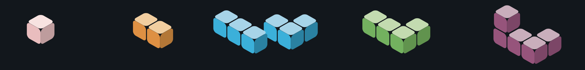

# Blokk! Solver
[Blokk!](https://blokk.games/) is the ultimate puzzle game. It is easy to learn, but hard to master. It's also an interesting mathematical and algorithmic puzzle, which this project explores.

Goals (NOW):
* Determine all solutions to the game
* An api that can return all possible solutions

Eventual goals (LATER):
* An 3D UX
* An AI player (the game is a great candidate for reinforcement learning)

---
[Kickstarter](https://www.kickstarter.com/projects/blokkgames/blokk-dare-to-be-square) | [Instagram](https://www.instagram.com/blokk.games) | [Get in touch to contribute](mailto:jake@honestgrowth.no)

